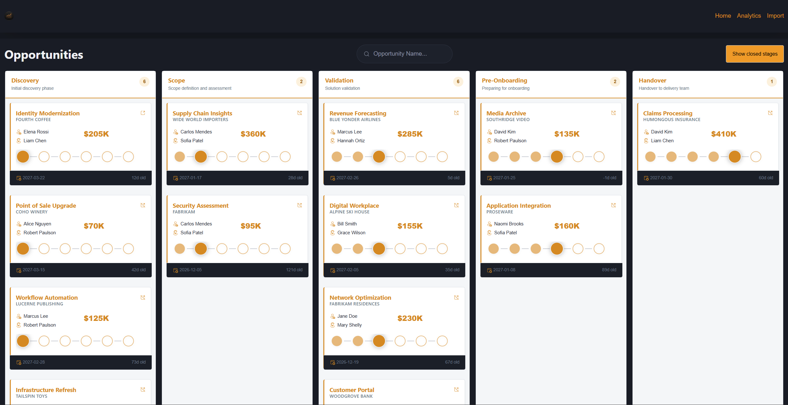
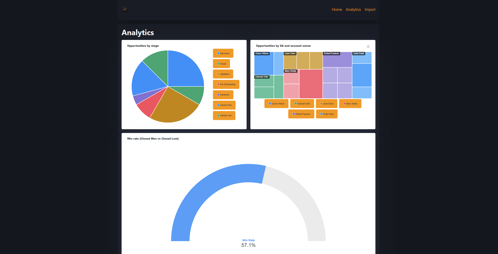

# ModernOppKanban

## Background

Basic tracking tool that allows exporting a view from SFDC to CSV, importing it here, then managing custom metadata for SAs to administer and run their business.

SFDC remains the source of truth and you can re-import over top without losing SA information.

## Running

`docker compose up`

Visit `http://localhost:80`

## Techstack

* Docker
* MongoDB Community with Atlas Search
* Blazor
* Apex Charts

## Screenshots

